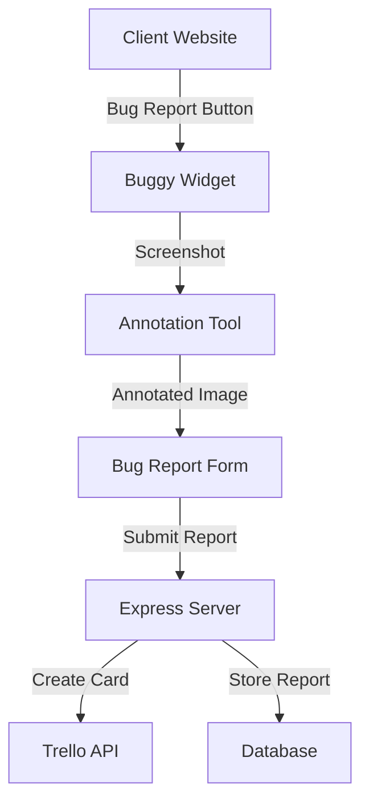

# 🐛 Buggy - Visual Bug Reporting Tool

<div align="center">

A lightweight, user-friendly bug reporting tool that allows users to capture screenshots, annotate them, and submit detailed bug reports through Trello integration.

[](https://www.jsdelivr.com/package/npm/buggy)
[](https://opensource.org/licenses/MIT)

</div>

---

## 📚 Table of Contents

- [Features](#-features)
- [System Architecture](#-system-architecture)
- [Quick Start](#-quick-start)
- [Installation](#-installation)
- [Usage](#-usage)
- [Server Setup](#-server-setup)
- [Client Integration](#-client-integration)
- [Configuration](#-configuration)
- [API Reference](#-api-reference)
- [Development](#-development)
- [Browser Support](#-browser-support)
- [License](#-license)

## ✨ Features

- 📸 One-click screenshot capture
- ✏️ Built-in annotation tools (pen, arrow, rectangle, text)
- 🎨 Multiple color options for annotations
- 📝 Structured bug report form
- 🔄 Automatic Trello card creation
- 🚀 Easy integration via CDN
- 💅 Modern and responsive UI

## 🏗 System Architecture



### Components

1. **Client-Side**
   - Buggy Widget (main interface)
   - Screenshot Capture Module
   - Annotation Tool
   - Bug Report Form

2. **Server-Side**
   - Express.js Server
   - Trello Integration Service
   - Error Handling Middleware
   - Rate Limiting

## 🚀 Quick Start

### Using CDN

```html
<!-- Add to your HTML -->
<script src="https://cdn.jsdelivr.net/npm/buggy@latest/dist/buggy.min.js"></script>

<script>
  const bugReporter = new Buggy({
    apiUrl: 'your-server-url/api/bugs',
    trelloKey: 'your-trello-key'
  });
  bugReporter.initialize();
</script>
```

### Using npm

```bash
npm install buggy
```

```javascript
import Buggy from 'buggy';

const bugReporter = new Buggy({
  apiUrl: '/api/bugs',
  trelloKey: 'your-trello-key'
});
bugReporter.initialize();
```

## 🔧 Server Setup

1. Clone the repository:
```bash
git clone https://github.com/yourusername/buggy.git
```

2. Install server dependencies:
```bash
cd server
npm install
```

3. Configure environment variables:
```bash
cp .env.example .env
# Edit .env with your Trello credentials
```

4. Start the server:
```bash
npm run dev  # Development
npm start    # Production
```

### Server Environment Variables

```env
PORT=3000
TRELLO_API_KEY=your_trello_api_key
TRELLO_TOKEN=your_trello_token
TRELLO_BOARD_ID=your_board_id
TRELLO_LIST_ID=your_list_id
```

## 🔌 Client Integration

### Method 1: CDN Integration

```html
<script src="https://cdn.jsdelivr.net/npm/buggy@latest/dist/buggy.min.js"></script>
```

### Method 2: npm Package

```bash
npm install buggy
```

```javascript
import Buggy from 'buggy';
```

## ⚙️ Configuration Options

| Option | Type | Default | Description |
|--------|------|---------|-------------|
| apiUrl | string | '/api/bugs' | Server endpoint for bug reports |
| trelloKey | string | - | Your Trello API key |
| buttonText | string | 'Report Bug' | Custom button text |
| buttonPosition | object | `{ bottom: '20px', right: '20px' }` | Button positioning |
| theme | string | 'light' | UI theme ('light' or 'dark') |

## 📡 API Reference

### POST /api/bugs

Creates a new bug report and Trello card.

**Request Body:**
```json
{
  "title": "Bug title",
  "description": "Detailed bug description",
  "severity": "low|medium|high|critical",
  "screenshot": "base64_encoded_image_data",
  "metadata": {
    "browser": "Chrome 91.0",
    "os": "Windows 10",
    "url": "https://example.com/page"
  }
}
```

**Response:**
```json
{
  "success": true,
  "cardId": "trello_card_id",
  "cardUrl": "https://trello.com/c/card_url"
}
```

## 🛠 Development

### Project Structure
```
.
├── client/
│   └── src/
│       └── buggy/
│           ├── index.js           # Main entry point
│           ├── core/
│           │   └── Buggy.js      # Core functionality
│           ├── components/
│           │   ├── AnnotationTool.js
│           │   └── BugReportForm.js
│           └── utils/
│               └── index.js
└── server/
    ├── api/
    │   ├── routes/
    │   ├── controllers/
    │   └── services/
    ├── config/
    └── index.ts
```

### Build Commands

```bash
# Client
npm run build:client     # Build client library
npm run watch:client     # Watch mode

# Server
npm run build:server     # Build server
npm run dev:server       # Development mode
npm run start:server     # Production mode
```

## 🌐 Browser Support

- Chrome (latest)
- Firefox (latest)
- Safari (latest)
- Edge (latest)

## 📄 License

MIT License - feel free to use in your own projects 