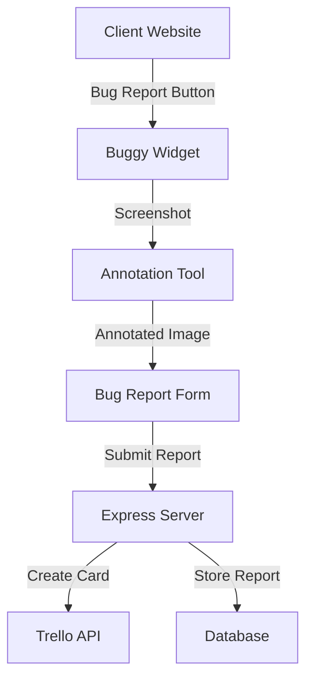

# 🐛 Buggy - Visual Bug Reporting Tool

<div align="center">

A lightweight, user-friendly bug reporting tool that allows users to capture screenshots, annotate them, and submit detailed bug reports through Trello integration.

[](https://www.jsdelivr.com/package/npm/buggy)
[](https://opensource.org/licenses/MIT)

</div>

---

## 📚 Table of Contents

- [Features](#-features)
- [System Architecture](#-system-architecture)
- [Quick Start](#-quick-start)
- [Installation](#-installation)
- [Usage](#-usage)
- [Server Setup](#-server-setup)
- [Client Integration](#-client-integration)
- [Configuration](#-configuration)
- [API Reference](#-api-reference)
- [Development](#-development)
- [Browser Support](#-browser-support)
- [License](#-license)

## ✨ Features

- 📸 One-click screenshot capture
- ✏️ Built-in annotation tools (pen, arrow, rectangle, text)
- 🎨 Multiple color options for annotations
- 📝 Structured bug report form
- 🔄 Automatic Trello card creation
- 🚀 Easy integration via CDN
- 💅 Modern and responsive UI

## 🏗 System Architecture



### Components

1. **Client-Side**
   - Buggy Widget (main interface)
   - Screenshot Capture Module
   - Annotation Tool
   - Bug Report Form

2. **Server-Side**
   - Express.js Server
   - Trello Integration Service
   - Error Handling Middleware
   - Rate Limiting

## 🚀 Quick Start

### Using CDN with Script Tag

```html
<!-- Add to your HTML -->
<script src="https://cdn.jsdelivr.net/gh/yourusername/buggy@main/client/src/buggy/index.js"></script>

<script>
  // When loaded via script tag, Buggy is available as a global variable
  const bugReporter = new Buggy({
    apiUrl: 'http://your-server:3000/api/feedback',
    buttonText: 'Report Bug',
    buttonPosition: { bottom: '20px', right: '20px' }
  });
  bugReporter.initialize();
</script>
```

### Using npm with ES Modules

```bash
npm install buggy
```

```javascript
// Import the Buggy class
import Buggy from 'buggy';

// Create and initialize the bug reporter
const bugReporter = new Buggy({
  apiUrl: 'http://your-server:3000/api/feedback',
  buttonText: 'Report Bug',
  buttonPosition: { bottom: '20px', right: '20px' }
});
bugReporter.initialize();
```

### Using with Next.js

```jsx
import { useEffect } from 'react';
import Script from 'next/script';

export default function YourComponent() {
  useEffect(() => {
    // Initialize Buggy when component mounts (client-side only)
    if (typeof window !== 'undefined' && window.Buggy) {
      const bugReporter = new Buggy({
        apiUrl: 'http://your-server:3000/api/feedback',
        buttonText: 'Report Bug',
        buttonPosition: { bottom: '20px', right: '20px' }
      });
      
      bugReporter.initialize();
    }
  }, []);

  return (
    <>
      {/* Load Buggy script */}
      <Script
        src="https://cdn.jsdelivr.net/gh/yourusername/buggy@main/client/src/buggy/index.js"
        strategy="beforeInteractive"
      />
      
      {/* Your component content */}
    </>
  );
}
```

## 🔧 Server Setup

1. Clone the repository:
```bash
git clone https://github.com/yourusername/buggy.git
```

2. Install server dependencies:
```bash
cd server
npm install
```

3. Configure environment variables:
```bash
cp .env.example .env
# Edit .env with your Trello credentials
```

4. Start the server:
```bash
npm run dev  # Development
npm start    # Production
```

### Server Environment Variables

```env
PORT=3000
TRELLO_API_KEY=your_trello_api_key
TRELLO_TOKEN=your_trello_token
TRELLO_LIST_ID=your_list_id_here

# Optional - label IDs for categorizing cards
TRELLO_LABEL_BUG=bug_label_id_here
TRELLO_LABEL_FEATURE=feature_label_id_here
TRELLO_LABEL_IMPROVEMENT=improvement_label_id_here

# Optional - label IDs for priority levels
TRELLO_LABEL_HIGH_PRIORITY=high_priority_label_id_here
TRELLO_LABEL_MEDIUM_PRIORITY=medium_priority_label_id_here
TRELLO_LABEL_LOW_PRIORITY=low_priority_label_id_here
```

### Screenshot Handling

The server handles screenshot attachments in a robust way:

1. Screenshots are captured in the browser as base64 data
2. When submitted to the server, screenshots are first validated
3. The server creates a Trello card with formatted description
4. Screenshots are uploaded as multipart/form-data attachments to the card
5. The system includes fallback mechanisms for large images

This approach ensures reliable handling of screenshots regardless of size or format.

## 🔌 Client Integration

### Method 1: CDN Integration

```html
<script src="https://cdn.jsdelivr.net/npm/buggy@latest/dist/buggy.min.js"></script>
```

### Method 2: npm Package

```bash
npm install buggy
```

```javascript
import Buggy from 'buggy';
```

## ⚙️ Configuration Options

| Option | Type | Default | Description |
|--------|------|---------|-------------|
| apiUrl | string | '/api/feedback' | Server endpoint for bug reports |
| buttonText | string | 'Report Bug' | Text displayed on the button |
| buttonPosition | object | `{ bottom: '20px', right: '20px' }` | Button positioning |

## 📡 API Reference

### POST /api/feedback

Creates a new bug report and Trello card.

**Request Body:**
```json
{
  "title": "Bug title",
  "description": "Detailed bug description",
  "category": "ui|functionality|performance|other",
  "priority": "low|medium|high|critical",
  "steps": "Steps to reproduce the bug",
  "screenshot": "base64_encoded_image",
  "url": "Current page URL",
  "browser": "Browser information"
}
```

**Success Response:**
```json
{
  "success": true,
  "message": "Feedback submitted successfully",
  "data": {
    "cardId": "trello_card_id",
    "cardUrl": "https://trello.com/c/card_short_id"
  }
}
```

**Error Response:**
```json
{
  "success": false,
  "message": "Error message explaining what went wrong"
}
```

## 🛠 Development

### Project Structure
```
.
├── client/
│   └── src/
│       └── buggy/
│           ├── index.js           # Main entry point
│           ├── core/
│           │   └── Buggy.js      # Core functionality
│           ├── components/
│           │   ├── AnnotationTool.js
│           │   └── BugReportForm.js
│           └── utils/
│               └── index.js
└── server/
    ├── api/
    │   ├── routes/
    │   ├── controllers/
    │   └── services/
    ├── config/
    └── index.ts
```

### Build Commands

```bash
# Client
npm run build:client     # Build client library
npm run watch:client     # Watch mode

# Server
npm run build:server     # Build server
npm run dev:server       # Development mode
npm run start:server     # Production mode
```

## 🌐 Browser Support

- Chrome (latest)
- Firefox (latest)
- Safari (latest)
- Edge (latest)

## 📄 License

MIT License - feel free to use in your own projects 